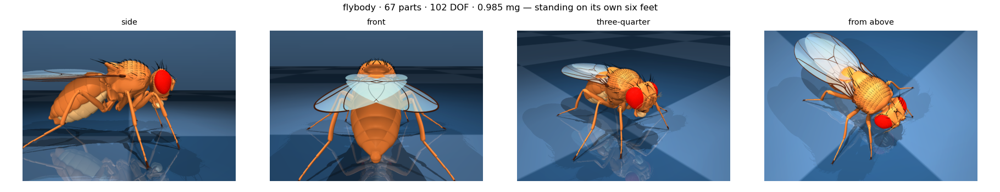

# FlyBrain — a fruit fly that moves because its nervous system says so

We are rebuilding this project from the nervous system out.

Everything that used to be here — a 3-D world, a scripted ethology layer, a
hand-written gait oscillator, flight physics bolted onto a floating body — has
been removed. It is all still in the
[`archive/round5-world`](../../tree/archive/round5-world) branch if it is ever
wanted, but it is not the foundation any more. The fly walked strangely because
it was being *told* to walk by code we wrote, not because its nervous system
asked it to.

> **Status:** step 1 is measured — the body, the nerve structure, and the fly
> standing on its own six feet under real physics
> ([`reports/step1_anatomy.md`](reports/step1_anatomy.md)). Step 2 has taken the
> leg reflex out of the connectome and checked it against the papers
> ([`docs/STEP2.md`](docs/STEP2.md)): the organ contacts the published cell
> types, and the path is disynaptic as published. **Step 3 has closed the loop**
> ([`docs/STEP3.md`](docs/STEP3.md)): the pools drive the muscles, the muscles
> move the joints, the joints drive the organs, and the organs drive the pools
> back — with no clock and no trained network anywhere in the path. The animal
> still stands, and the leg resists being pushed (ρ = +0.125 and +0.186, both
> resolved). Reverse the organ's published transduction polarity and the reflex
> reverses with it (−0.073, −0.087), which is what shows the resistance comes
> from the biology and not from the wiring. The switch the reflex literature
> predicts — resistance turning to assistance under load — **did not appear**,
> and is published as not found.
>
> **Step 4** ([`docs/STEP4.md`](docs/STEP4.md)) drives all six legs, each from
> its own cord, and puts the animal in a world you can look at
> (`python3 tools/serve_world.py`). The body is the real Janelia/DeepMind
> *flybody* model — 85 scanned meshes, 262,180 triangles — and the movement is
> not animated: it is a recording of the simulation. **The animal stands, on
> five or six feet, and it does not walk.** That is the honest result: six
> cords built independently cannot coordinate, and a tripod gait is the first
> thing step 5 owes.

## What "real" means here

A connectome is a wiring diagram: which neuron contacts which, how strongly, how
many synapses. It is not a controller and it does not come with a gait. The
original Janelia/DeepMind virtual fly
([Janelia, 2024](https://www.janelia.org/news/artificial-intelligence-brings-a-virtual-fly-to-life);
[Vaxenburg et al., Nature 2025](https://www.nature.com/articles/s41586-025-09029-4))
solved this by training a neural network on recordings of real flies. We are
taking the other route the same paper names as its own next step: drive the body
from the **actual** connectome, including the ventral nerve cord, with the local
circuits and sensory feedback that real insects use.

So the rule for this repository is:

> A number is either **measured** (published, or read out of a source file at
> build time), or it is **declared as an assumption in
> [`docs/ASSUMPTIONS.md`](docs/ASSUMPTIONS.md) with its reason and its test.**
> There is no third category, and "it made the walk look better" is not a
> reason.

## Step 1 — the body and the nerve structure

### The body

Read directly out of the Janelia/DeepMind `flybody` MuJoCo model by
`tools/step1_anatomy.py`. Not transcribed, not paraphrased.

| | |
|---|---|
| Body parts | **67** |
| Articulated joints | **102** (the 103rd is the free root) |
| Articulated degrees of freedom | **102** |
| Actuators | **78** — 70 joint muscles + **8 adhesion** (2 labrum, 6 claws) |
| Mass | **0.985 mg** (a real fly is ~0.96 mg) |
| Trunk length | **2.97 mm** (a real fly is 2.5–3 mm) |
| Wing span | 6.12 mm in the rest pose |
| Integrator step | 100 µs |

The 8 adhesion actuators are the ones the Janelia article describes as a
newly-added model of "the forces generated by insect feet gripping a surface".
Without them the animal cannot hold on to anything; with them, it can.

### The nerves

BANC v888 is the only public connectome of an *adult* fly that contains the
**brain and the ventral nerve cord together**, in one animal. That is the whole
reason it is the dataset here: a brain-only connectome has zero leg motor
neurons, so "descending neuron fires → leg steps" can only ever be invented.
BANC has the cells that move the legs.

| | |
|---|---|
| Motor neurons | **532** |
| Leg motor neurons | **391**, across T1/T2/T3 × left/right |
| Wing motor neurons | 60 (24 power, 24 steering, 12 tension) |
| Sensory cells | 6,699 tactile · 2,903 proprioceptive · 1,187 auditory · 3,011 olfactory |
| Licence | **CC BY 4.0** |

And crucially, each leg motor neuron is annotated with **the muscle it
innervates** — `tibia_flexor_muscle`, `femur_reductor_muscle`,
`sternal_posterior_rotator_muscle`, and so on — so motor neurons can be mapped
onto joints from two published vocabularies rather than by guesswork.
`tools/step1_anatomy.py` does that mapping and reports anything that does not
land, instead of dropping it quietly.

### The physics spine

`tools/step1_sim.py` drops the animal onto a floor in MuJoCo with every muscle
commanded to its anatomical rest length and checks that it is stable:

```
COM height      -0.1626 -> -0.2411 mm   (second-half sd 0.00015 mm)
horizontal drift  0.03115 mm
feet on the floor 6.00 of 6
max joint speed   0.0032 rad/s
VERDICT: STANDING
```



Any walking controller has to stand on top of this. There is no controller in
this repository yet.

## Reproducing

```bash
pip3 install numpy pandas pyarrow mujoco
bash tools/download_banc.sh          # 86 MB, public, no auth
bash tools/download_flybody.sh       # 41 MB, Apache-2.0

python3 tools/step1_anatomy.py       # body + nerve inventory, both verified
python3 tools/step1_sim.py --seconds 3.0 --render out/stand.png
```

Headless machines need a GL backend for the render step only; the physics runs
without one. On a box with no EGL device:

```bash
apt-get download libosmesa6 && dpkg-deb -x libosmesa6_*.deb /tmp/osmesa
export LD_LIBRARY_PATH=/tmp/osmesa/usr/lib/x86_64-linux-gnu MUJOCO_GL=osmesa
```

## Layout

```
tools/step1_anatomy.py   67 parts, 102 DOF, 78 actuators, 532 motor neurons — all read, none written
tools/step1_sim.py       the physics spine: the animal standing, headless, measured
tools/step2_legcircuit.py the leg's sensorimotor subgraph, extracted from BANC
tools/step2_reflex.py    the reflex: arcs, disynaptic weights, LIF, sign-shuffled control
tools/step2_walk.py      (next) the closed loop onto the body
tools/build_banc.py      BANC v888 -> flybanc.bin, for the app's brain view
tools/verify_banc.py     structural checks + a reference LIF simulation
tools/download_*.sh      the two public downloads, no authentication
docs/STEP1.md            what step 1 is, and what it refuses to do
docs/STEP2.md            the leg reflex out of the connectome, against the papers
docs/ASSUMPTIONS.md      every constant that is not a measurement, with its test
FlyBrain/Sources/        the iOS app: the connectome as a live 3-D point cloud
reports/step1_anatomy.md generated evidence, regenerated on every build
```

## The iOS app

The app currently shows the connectome — 175,237 neurons and 2.17 M synapses
from BANC v888 — running as a spiking leaky-integrate-and-fire network on the
phone's GPU. That half of the project was already real and it stays. The body
and the world come back only when Step 1 says they may.

Every push to `main` builds an unsigned `.ipa` you can sideload with
[Sideloadly](https://sideloadly.io) or [AltStore](https://altstore.io); grab it
from the Actions tab.

## Data attribution

- **flybody** body model — TuragaLab, HHMI Janelia + Google DeepMind, Apache-2.0.
  Vaxenburg et al. (2025) *Nature*.
- **BANC v888** connectome — Bates et al. (2026) *Nature*, **CC BY 4.0**.
- Conceptual reference: the FlyVision project by Ali Murat Bozaci.
