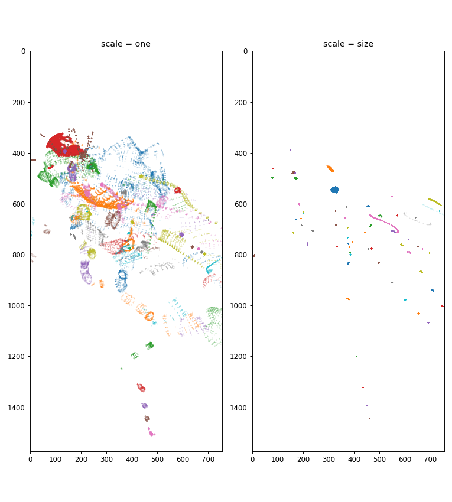
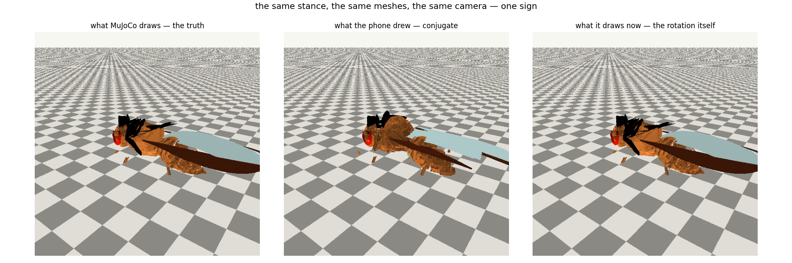

# AUDIT — where this repository stands against the brief

Read this before changing anything. For the state *now* — the 28 items, what was
re-measured on the current HEAD, and what the phone should show after the next
build — see [`docs/STATUS_TH.md`](STATUS_TH.md). Nothing here was rebuilt from scratch; the
inventory below is of the tree as it stood at `3353a74`, reconciled with the
fixes that landed on `main` while it was written (`7b05f8b`…`2beb443`: the
part-axis fix, the no-recording policy, the two-bar UI, the step-6 motor-pool
work) and with the scale fix in the commit that carries this file. Every claim
names the file or report it comes from. Status values:

* **DONE** — the link exists, is tested, and no scripted path bypasses it.
* **PARTIAL** — exists, but with a named gap.
* **MISSING** — not present; the brief requires it.
* **NEXT** — the gap this audit puts at the top of the queue.

---

## 0. Why the phone showed what it showed

The two screenshots that prompted this audit are from **build `575faf1`
(step 4)**, the last run that went green. Three facts pin that down:

1. `acbdd33` (step 5) failed CI at `Build for the simulator`:
   `WorldView.swift:216: invalid redeclaration of 'body'` — fixed at HEAD by
   renaming the stored property to `animal`.
2. The screenshot's HUD text ("the fly, in its own world", "moved 0.00 units")
   and its **scrub slider + 0.1×/0.25× speed buttons** only exist in the step-4
   recording playback, which `acbdd33` deleted.
3. The "Map" pill drawn *on top of* the ≈power readout is the old pair of
   absolute overlays that HEAD merged into one `HStack`.

**And one more that run 49 exposed** (see the end of reports/step6_loop.md): the
`.ipa` carried no `fly_body.json`, because `tools/pack_world.py` deleted every
file in `FlyBrain/World/` that was not its own — including the body asset
`tools/pack_body.py` had written four seconds earlier. The Body screen had
nothing to load on the phone, and the three solver tests (`golden trace`,
`standing on tone`, `muscle model`) **skipped themselves** in every green CI run
(`Executed 7 tests, with 3 tests skipped`). Fixed by making each packer delete
only what it owns, by a `.ipa` gate that names both files, and by
`tools/check_tests.py`, which fails the build on any skip.

So the recording ("a wiggling video") and the HUD collision were already being
fixed when the screenshots were taken — but the build never shipped, and one
worse bug was still hiding underneath. Two more bugs were fixed in the
meantime on `main` and are kept here: **the part axis** (`3047e92` — the
floor is recorded as part 0, every renderer skipped it and then counted for
itself, so each mesh wore the pose of the part before it; the manifest now
*writes* `part` and CI asserts it) and **the recording policy** (`b20c200` —
the .ipa may not carry `frames.bin` at all, asserted in CI).

### The bug that would have shipped with step 5 anyway

**`geom_size` was being used as a scene-graph scale.** For mesh geoms MuJoCo's
`geom_size` is the axis-aligned bounding box *half-extent* — measured off the
compiled model, `thorax = [0.0439, 0.0584, 0.0601]` cm against a raw mesh AABB
of `[0.0439, 0.0527, 0.0580]`. Both `FlyWorld.apply(frame:)` and the three.js
viewer multiplied every part's vertices by that number, shrinking each part to
4–9 % of its true size: a scatter of slivers and dots where the animal should
be. `apply(live:)` never reset the scale, so the live-solver path inherited the
same wrong scale from `init`'s `apply(frame: 0)`.

The figure projects `frames.bin` frame 77 through the app's own camera
(azimuth 2.2, elevation 0.42, distance 0.6, 38° fov, 755×1572): left is
correct (a fly), right is what the app drew and what the screenshot shows.
The fix is to scale by **1** — the vertices packed by `tools/step4_world.py`
are already in model centimetres, which is also what `geom_size` and
`geom_rbound` are computed from.

### The bug the second screenshot showed: a conjugate quaternion

`IMG_2713` is from the step-6 build, and its HUD says the physics is fine —
`feet 6/6 · COM z −0.0228 cm · 6 contacts` — while the picture above the HUD is
the animal in pieces. The physics was fine. The **drawing** was not: the app's
matrix → quaternion conversion returned the **conjugate** of the rotation (x, y,
z negated in the trace branch and w negated in the other three, which is the
inverse rotation), so SceneKit spun every part the wrong way about its own
origin. Positions were right to 1e-15 cm and parts stayed on their own bodies;
only the orientation of each part was wrong, by up to **171.5°** — enough for a
wing to point backwards and a thorax to look like a detached wedge.

How it was found, in order, because the order is the point:

1. `tools/audit_meshes.py` (new, now a CI step) compares the asset's own
   `visual` table — `pos`, `quat`, and the body each part names — against
   MuJoCo at the stance: **0 parts off by more than 1e-6 cm, worst 7.7e-15 cm,
   worst rotation error 0.000°, 0 parts on the wrong body.** So the asset the
   app draws from was not the problem, and neither was the solver.
2. `local/main.swift` grew a `visual` mode that dumps the pose the renderer is
   handed. Drawing the app's own packed vertices with that pose reproduces
   MuJoCo's geometry to **9.7e-15 cm on all 85 parts** — if the nine numbers are
   read as `FlyDynamics.Mat3` reads them (three *columns*); read row-major they
   are wrong by up to 7.4e-2 cm, which is what a transposed matrix looks like.
3. That left only the conversion at the end of the chain. `FlyWorld.quaternion`
   and `WorldRig.quaternion` were two copies of the same routine; the first one
   had its signs swapped in **all four** Shepperd branches. A/B on the stance,
   rotating a probe vector the way SceneKit does:

   | | worst miss, per unit vector |
   |---|---|
   | the conjugate (what shipped) | **1.994 cm** = 171.5° of error (`wing_left_brown`) |
   | the rotation itself (fixed) | 2.1e-15 cm |

Fixes, all of them gates rather than promises:

* `quatFromMat` now lives in `FlyDynamics.swift`, beside the `quatToMat` it
  inverts — one implementation, and the one the Linux test runner can reach.
  `FlyWorld`'s copy is deleted; `WorldRig` calls the shared one.
* `FlyBrainTests/MeshPoseTests.swift` (new, both tests in
  `tools/check_tests.py`'s REQUIRED list) checks the round trip on nine
  rotations that hit every Shepperd branch including 180°, and then checks the
  renderer's whole contract on the animal's real stance pose: every part on its
  own body, and the quaternion turning three probe vectors exactly as the
  solver's matrix does — a conjugate fails that by twice the angle.
* `tools/audit_meshes.py` runs in CI, so the asset can never drift from the
  model in a way that only shows up on a screen.

**The `0/42 pools firing · 0.0 Hz` from that screenshot is found and fixed**
(2026-10-06, `IMG_2714`). It was not the connectome being quiet and it was not
the engine: `FlyCord.source` was `weak`, and the Body screen builds the source as
a local

    let source = SimulationRateSource(engine: sim, groups: engine.groupNames)
    let c = FlyCord(asset: live.asset, source: source)

which nothing else retained — so ARC freed it the moment `WorldView.attachCord`
returned, and every `source?…` in the loop became a no-op: no tone out to the
descending cells, no organ drives, and 0 Hz for every rate in. The next
screenshot's HUD is what identified it, because it prints both halves:
`desc 0.0 Hz (tone 2.5)` says the tone was *intended* and the GPU's own tally on
the same line says the pools were spiking (`spikes 393 (pools 15)`). The cord now
owns its source and cannot be built without one, and
`testTheCordOwnsTheRateSourceItReadsFrom` builds a cord the way the app does and
fails if the source is released — a test that was verified by putting the `weak`
back and watching it fail. It was invisible to the whole suite before that,
because a test holds its stub in a local that lives for the length of the test
*function*.

### The solver's own gap (found by run 54, 2026-10-05 — closed the same day)

Run 54 is the first run where the body asset reached the bundle. It is also the
first run in which `FlyDynamicsTests` was not skipped — and the port failed its
own golden trace, by a wide margin. **Both causes are found and fixed**, and the
trace now reproduces exactly (item 16, `reports/step5_aba.md`): a `Mat3()` that
was an identity where the spatial transforms needed a zero block, and an
articulated-body inertia that added the rank-one term Featherstone subtracts.
The failure text below is kept because it is what the next transliteration
should be measured against. Nothing about the
app's *behaviour* is claimed until that is fixed: the Python side is the
verified reference, the Swift side is a transliteration that has never actually
been checked against it until now.

What the port does do, and the trace does not test: the animal stands for three
simulated seconds on muscle tone alone, in CI (`testTheAnimalStandsWithMuscleToneOnly`
passes, 6.0 s). So the static terms — gravity, the joint springs, the floor
penalty, the muscle model's length term — are consistent; the disagreement is
in the velocity-product terms or in the hard stops, which are exactly what a
standing animal never exercises. The next measurement is the trace comparison
the test now performs (`step 0, 25, 50 …`) plus the hard-stop count, and it is
the first thing the next CI run reports.

**Where the "twenty times life size" reading came from, and why it is the
wrong file.** The `.obj` assets under `data/flybody/.../assets/` really are
ten times the compiled model — the thorax measures 1.16 units *there*. But
`tools/step4_world.py` packs `model.mesh_vert`, which MuJoCo has already
scaled at compile time: the thorax in `fly.bin` is 0.116 units, life size,
and `geom_rbound` (0.0946) matches the raw half-diagonal (0.0898), so nothing
multiplies the vertices again at render time. Measured on the file the app
actually draws: thorax extent `[0.0439, 0.105, 0.116]` in `fly.bin` against
`geom_size = [0.0439, 0.0584, 0.0601]` — `geom_size` is the half-extent, and
multiplying by it is what produced the sliver screenshot.

---

## 1–28, item by item

| # | Brief item | Status | Evidence / gap |
|---|---|---|---|
| 1 | Emergence, not scripted behaviour | **DONE** | No `WalkController`/`if foodDetected` anywhere; the old ethology layer lives only on `archive/round5-world`. `FlyLiveBody.drive` is the sole behaviour entry point, and it is now **set**: `WorldModel.attachCord()` hands it `FlyCord.update`, whose only inputs are the body's own organ readings and the firing rates of the connectome's motor pools. There is no gait, no state machine and no schedule in the file (docs/STEP6.md §"The switch, as built"). |
| 2 | Species, adult anatomy | **DONE** | Unmodified Janelia/DeepMind flybody: 67 parts, 102 articulated DOF, 78 actuators, 0.985 mg, 2.97 mm — asserted in CI (`Step 1 — assert the anatomy`). |
| 3 | Priority order (nervous system → … → graphics) | **DONE** | CI gates run anatomy → reflex → closed loop → world → solver before the app builds; graphics deliberately minimal. |
| 4 | Lightweight anatomically structured 3-D model | **DONE** | 85 scanned meshes (head, both eyes, antennae, proboscis, 3 thoracic segments, both wings, both halteres, A1–A6+, 6 legs) packed by `tools/step4_world.py`. Scale bug fixed in this commit. |
| 5 | Leg segments, joints, contact, adhesion | **DONE** | coxa→trochanter→femur→tibia→tarsus→tarsomeres→claw in the asset; per-segment mass/inertia/joint limits from the MJCF; 74 penalty contacts + 8 adhesion actuators; `AnatomyTests` pins all of it. |
| 6 | Wings as actuatable structures, aero hooks | **DONE, with a stated gap** | `tools/wing_aero.py` measures the wing out of the body model (planform 1.741 mm², reach 2.65 mm, AR 3.96, ∫r²dA 4.164e-4 cm⁴, r̂₂ = 58 % of the reach, stroke plane 47.5° off horizontal, strip areas summing to the planform to 100.00 %) and integrates Dickinson, Lehmann & Sane's measured coefficients over 12 strips per wing in the body's own frame. At full activation the two wings make **lift/weight 1.00** at a mid-stroke α of 44.9°, against the 45–50° the same authors measured in the animal; the force is 47.3° forward of vertical, so the animal holds a nose-up attitude and at exactly that attitude the beat's force is its weight. A left-right amplitude asymmetry makes **+0.046 / −0.046 dyn·cm** of yaw moment that reverses with the asymmetry — and by the physical sign (the harder-driven wing pushes its own side forward, so the nose goes the other way). Through the shipped connectome: the four wing pools are calibrated one at a time (the two power pools run at 173.7 and 212.3 Hz at full drive, so a shared reference would fly the animal in a circle), a ±0.9 steering differential makes −0.0164 dyn·cm of yaw, and the haltere→wing-steering reflex arc the connectome already contains (8 and 10 direct synapses, measured in item 7) moves the steering pools by 3–40 Hz at 400 °/s. The app carries it: `WingAero.swift` (golden table generated from the tool), an external wrench channel in `FlyDynamics`, the beat in `FlyLiveBody`, the four pools in `FlyCord`, a HUD line. Two rehearsals must fail the gate in CI. The body model's two wings are not one wing used twice: their planform areas differ by **6.6e-05** and their ∫r²dA by 7.5e-05, so each wing is integrated with its own strips and its own radius about the stroke axis, and the golden block carries both (four geometry vectors and a strip table per wing) — the Swift port was transcribed back into Python and reproduces the tool's own pasted numbers for all 9 beats and all 25 law rows to **1.8e-15 relative**, which is what `WingAeroTests` checks (1e-9) and what the CI step re-runs; the model's measured left-right floor, 1.6e-05 dyn, is quoted in the test that compares the two wings instead of being hidden by its tolerance. **Gap:** the wingbeat's kinematics are the animal's measured ones held by the joint's own spring — the stretch-activated flight muscles and the thorax resonator that generate them are not modelled (ASSUMPTIONS #37); no separate unsteady-aerodynamic peak (#38); the model's wing mass is 8 µg against a real ~1 µg (#35); the tension pools are unused; and whether the haltere→wing-steering arc stabilises or drives yaw is left open — the measurement is not antisymmetric in the turn direction, and papering over that with a sign flip is exactly what this repository does not do. Report: `reports/item6_wings.md`. |
| 7 | Halteres as gyro sensors | **DONE, with a stated gap** | `tools/haltere_gyro.py` measures the pair out of the body model (mass 0.822 µg, hinge→CoM 0.172 mm, the two sensitivity axes `a = v̂ × n̂` mirror to 1.0000, the Coriolis force 0.35 % of the in-plane force at 100 °/s) and derives the channels: yaw and roll in the difference of the two halteres (99.7 %), pitch in their sum (99.9 %). Driven from the pair, on the shipped connectome: a 400 °/s yaw moves the difference between the two afferent pools by +79.8 Hz (error ±1.3, and the baseline offset −24.7 Hz is the pools' own asymmetry, not noise); a 400 °/s pitch moves their sum by +40.4 Hz and their difference by −6.0 Hz. The smallest resolvable turn is 10 °/s in 1 s. The body's own angular velocity now reaches both populations every simulated millisecond, through `HaltereGyro.swift` and world.json's `haltere` block. The afferent→motor pathway is structural: the afferents synapse directly onto `motor_neck` (31 cells) and both wing-steering pools (10 and 8), which is the monosynaptic reflex Fayyazuddin & Dickinson recorded. **Gap:** nothing steers with it — the cells beyond the afferents do not move with the rotation in a 1 s window, and the walking haltere regime is not modelled. Report: `reports/item7_haltere.md`. |
| 8 | Connectome, multi-resolution, sparse/GPU | **PARTIAL** | BANC v888 in-app: 175,237 neurons, 2.17 M synapses, CSR columns, `bytesNoCopy` mmap, zero per-neuron objects, GPU LIF (`SimulationEngine`, `LIF.metal`). **Gap:** only one resolution exists (~2 M); the brief wants small/debug→2 M→10 M→50 M→100 M+ under one format — the sectioned `flybanc.bin` v2 format is the seam, resolution tiers not yet built. |
| 9 | Brain → VNC → motor neurons separation | **PARTIAL** | The data model has it: BANC carries brain and cord in one animal, 532 MNs annotated to muscles, `NeuronInfo.isVNC`, system ranges for T1/T2/T3/abdomen. The two screens now share **one** `SimulationEngine` (`BrainEngine.pump`), so the body's cord runs on the same running connectome the Map draws, through the same synapse graph — organ cells → VNC → motor pools is the real path, not a re-implementation. The brain's tone now arrives the way the reference sends it: `FlyCord.update` injects it into the **descending** population on every millisecond of every phase (`descendingDrive`, the same `args.desc` current `tools/step3_closedloop.py` puts on `net.desc_idx`), which is what "descending neurons are the only source of tone" means here — the organs report what their receptors see, and at rest that is the same number (assumption #10). That this is a pathway and not a label is measured in the artifact the app carries: `tools/verify_descending.py` counts **3,283 synapses from the 1,316 descending cells onto the 371 pool motor neurons** (52–59 per leg, every leg reachable, 367/371 within two hops) in `build/flybanc.bin`, and CI runs it. **Gap:** what that tone *does* to the stance on the phone is the acceptance test of item 27 and needs hardware; it must not be claimed before it is measured. |
| 10 | Vision as signals, not booleans | **DONE** | `CameraFeed` samples the phone camera into 10,647 photoreceptor UVs per eye, with measured LMC gain 8–10× and ~100 ms adaptation (`SimParams`, ASSUMPTIONS #15); no `enemyDetected` anywhere. Optic-flow/motion readouts beyond the LIF substrate: not yet (the network itself does the motion work). |
| 11 | Odor as a spatial/temporal field | **DONE, with a stated gap** | `tools/odor_field.py` defines a kinematic plume (filaments at 20 % duty, 3.5 Hz, phase lag downwind), `OdorField.swift` is the same field in the app, and `world.json`'s `odor` block is the parameter set the app reads. The animal samples it at the body model's head geom. Measured on the app's own LIF (860 ms = 3 gust cycles, gain 12): receptors 20.98 Hz in clean air → **53.54 Hz** at the antennae; the cells the receptors synapse onto (26,359 synapses → 881 cells, 615 of them not olfactory, read from the packed connectome) follow, 232 → 252 Hz. A ladder of currents puts the receptor threshold at ~2–3, so the antennae's own filament peak is 9–12× it and a filament crosses it out to **1.7–2.0 cm** — the animal's smelling range, measured. **Gap:** the ascending/descending populations do not move beyond their own variability over three gust cycles, and the trochanter pool has 11 cells, so "the smell reaches the legs" is *not* claimed; BANC annotates no side for the olfactory cells (0 of 3,000), so it is one channel and two-antenna comparison is not possible from this data. Report: `reports/item11_odor.md`. |
| 12 | Touch / mechanosensation | **DONE** | The leg's tactile hairs are now a sense organ of the loop: `organ:<seg>_<side>:tactile`, one per leg (514/481 T1, 484/494 T2, 564/604 T3 cells, BANC's own `cell_function == "tactile"` with the leg's tag required — assumption #40), driven from **contact events, not load**: the floor force under the tarsus against 5 % of the load the leg carries standing, with hysteresis, a 2× phasic onset and a 30 ms adaptation (#41, #42), so a landing is a burst, a stance is the adapted level, and a lifted leg is silence — three states the campaniform organ's single load number cannot tell apart. Measured off-device on the shipped connectome (`tools/tactile_probe.py`, `reports/item12_touch.md`): every leg's organ reaches motor neurons directly (6.7–18.8 release sites) and routes through the cord's intrinsic neurons (80 % of the leg tactile cells' 37,253 outgoing edges); one footfall moves the leg's own pools — trochanter extensor 382.5 → 10.0 Hz, tibia flexor 242.5 → 47.5 Hz — and at equal drive the organ moves its leg's pools as strongly as the femoral chordotonal organ (2486.7 vs 2510.0 Hz) and more selectively (own/other 3.49 vs 2.66 vs 1.63 for the campaniform). On the device the channel's own state is on the HUD (`touch n/6`), and a standing animal is the same fixed point with the channel on or off (the adapted response is exactly the value the calibration clamps organs at), which `FlyCordTests` asserts. **Not claimed:** an avoidance reflex away from an obstacle — this body can touch the floor and nothing else; the tactile organs of the antennae, proboscis, wings and abdomen are in the connectome but are not driven. |
| 13 | Proprioception | **DONE** | `FlyProprioception` exposes joint angle, rate, leg load, body height, speed, feetDown, and the knee angle now drives the leg's chordotonal organ group (38–63 cells) with the published polarity: flexion stretches it, stretching silences it (assumption #11). The grip is measured on the device, not chosen (`FlyCordTests`). |
| 14 | Motor neurons → muscles → physics, no direct commands | **DONE** | The only path to the body is `posture + drive → excitation → muscleTorque → ABA solver → contacts`; high-level code never sets `q`, `position` or `velocity`. The source of `drive` is the cord: motor-pool firing rates → muscle activation → the balance of each joint's antagonist pair → excitation. |
| 15 | Force-based muscle model | **DONE** | Hill force-length, per-direction velocity term (shortening weakens, lengthening loads ≤1.8), antagonist pairs, measured `hold_torque` inversion, optional fatigue hooks not yet — `FlyDynamics.muscleTorque`, verified in `FlyDynamicsTests`. |
| 16 | Physics is the authority | **DONE** | The port reproduces the reference's golden trace **exactly**: all six final metrics `0.000000` against a tolerance of `1e-07`, the hard-stop fingerprint 4,044 in both, and no traced step off by more than `1e-9`; two runs byte-identical. Two port bugs were behind the 0.160 divergence of run 54 and both were settled against MuJoCo rather than against the reference (`tools/judge_port.py`): `Mat3()` is the identity, so the spatial transforms `xform`/`crm` carried a spurious identity in their upper-right block (now `Mat3.zero`), and the articulated-body inertia's rank-one term was **added** instead of subtracted (`IA + U Uᵀ/D` for Featherstone 7.42's `IA - U Uᵀ/D`). After both fixes the port's one-step rates are within **1.6e-15 rad/s** of the reference and its distance to MuJoCo is the reference's own, digit for digit (8.7e-04 rad/s worst over ten states). The reference itself is verified against MuJoCo: FK 4.4e-16, 20 ms free tumble, standing 1.5 s. A third port bug surfaced while checking the standing test: the initial state had the root at z = 0 instead of `stance_root_z`, so the animal hung 49 um above the floor with **no contact at all** and the stance servo held the legs against nothing — the standing scenario now reproduces the reference digit for digit (mean COM z -0.027384, six feet down, worst rate 2.644 rad/s). |
| 17 | Walking emerges from neural activity | **STARTED** — substrate measured | No walk controller exists (correct per the brief). `reports/item4_walking.md` says what the dataset decides before any code: the sense organs cannot couple the legs (their route to the pools is 85:1 private to their own leg), but the cord can — 788 cells synapse onto more than one leg's pools (69,543 synapses), now packed as `premotor:multileg` and CI-gated, with the packer's forward walk and `tools/coupling_probe.py`'s reverse walk agreeing on the count independently. And the cord does not *by itself* walk: `tools/gait_probe.py` finds no tripod structure in the six legs' pool rates under any of four drive conditions (tripod index −0.006 to −0.124), so the gait needs either a sparser operating point or a declared, labelled mechanism — a decision that is deliberately not made until the loops' own acceptance test (item 27) is measured on hardware. |
| 18 | Minimal environment | **PARTIAL** | Floor + grid + lights + walls-not-yet; no obstacles, odor sources, wind, surface types. The world exists to stimulate; keep it deliberately spare. |
| 19 | Emergent behaviours | **PARTIAL** | Standing + postural stability emerge from tone + physics (`testTheAnimalStandsWithMuscleToneOnly`). Reflex arc validated offline (step 2/3: ρ = +0.125/+0.186, polarity control reverses it). Walking/grooming/feeding/escape all follow items 9→17. |
| 20 | iPhone optimisation | **DONE** (brain), **PARTIAL** (body) | GPU LIF, packed CSR, zero-copy connectome, camera-sampled retina; body solver is CPU scalar Swift at 100 µs substeps with adaptive throughput (`realtime` readout). A GPU/Metal port of the ABA solve is possible later; not yet needed — device runs at a measured fraction of real time and reports it. |
| 21 | Graphics budget | **DONE** | Point-cloud brain, SceneKit flat lambert body, no shadows/post-effects; perf beats pixels in every trade so far. |
| 22 | Debug / observability | **PARTIAL** | Brain: FPS/spikes/rate/power, voltage/spiking/regions render modes, tap-to-inspect, stimulate. Body: feet-down, contacts, COM height, substep/RTF readouts, plus the cord's own line (`n/m pools firing · Hz · organs`) and how fast the connectome is actually running (`cord × real time`). The device build that produced `IMG_2713` printed `85 meshes · 262180 triangles · 102 joints`, `feet 6/6 · COM z −0.0228 cm · 6 contacts`, `0/42 pools firing · 0.0 Hz · organs campaniform+chordotonal · desc 2.5` and `cord 621 updates · 0.09× real time` — every number this item asks for except the per-pool breakdown and the muscle excitation. The per-pool readout it was missing is now on the body HUD: the loudest three pools by the rate the connectome reported, the descending rate beside the tone that was injected, the organ rate, and the connectome milliseconds the rates were averaged over (`FlyCord.loudestPools`, `FlyCord.descendingRateHz`). **Gap:** the muscle excitation per joint. |
| 23 | Biological data policy | **DONE** | `docs/ASSUMPTIONS.md` is the registry (every constant: source + test); CI reproduces published checks (Azevedo 2020 monosynaptic absence, Phelps 2021 campaniform presence, corrected-sign guard for 7b22dd1). Placeholders are named `placeholder` in the asset. |
| 24 | Modular, headless-capable architecture | **DONE** | Connectome / SimulationEngine / Renderer / FlyDynamics / FlyLiveBody / FlyWorld / WorldView are separate files with narrow seams; Python tools run the whole science pipeline headless; brain sim runs with no body and vice versa. |
| 25 | Incremental phases | **ON TRACK** | Phases 1–5 of the 12-phase plan complete and measured (reports/step1–5); current position ≈ phase 6–7 (VNC pathways, walking circuitry). |
| 26 | No fake intelligence | **DONE** | No LLM, no RL agent, no behaviour tree, no scripted ethology in `FlyBrain/Sources`. Debug-only utilities (stimulate, flat retinal drive) are labelled as such. |
| 27 | Acceptance test (closed loop) | **PARTIAL, with a warning measured** | The loop has now been run headless with the body answering the cord (`tools/walk_loop.py`, reports/item4_walking.md §4): with muscle tone only the animal stands (drift 0.0017 cm); with the cord attached at the app's operating point the pools fire 51–61 Hz and the animal *presses into the floor* (COM 2.1× deeper, loads 0.30–2.42 of the stance), which the frozen-organ control shows is the cord's resting command and not the feedback. The cause is measured: the reference balance is calibrated with the organs clamped and run with them live. So the device screenshot after the readout fix will show a distorted stance, not a stand — expected, and item 4's to solve. |
| 27a | (context) the same item before the fix | **historical** | Offline: steps 2–4 closed the loop in Python (organ→pool→muscle→joint→organ). In-app: organ → connectome → motor pool → muscle → joint is now closed on the device, with `b_ref` measured on the device and every group name checked against the shipped connectome by `tools/verify_loop.py`. **Gap:** the reflex has not yet been re-measured *through the app's engine* (pool rates, joint angle, latency) — that is the acceptance test docs/STEP6.md names, and it needs hardware. It must not be claimed until it is measured. |
| 28 | Judged by biology, not pixels | **DONE** (discipline) | Every shipped stage has a report with numbers; the scale bug above was found by measurement (projection test), not by looks. |

---

## Delivery order (what follows this commit)

1. **This commit** — scale bug (both renderers), HUD restructure so readouts
   and buttons can never collide, control panel scrollable within its card,
   default camera distance fits the real-size fly. Then CI green → new .ipa.
2. **The closed loop in-app** — a cord module: BANC leg-circuit pools bundled
   as a small asset, LIF pools on the body side, `proprioception → pools →
   motor pool rates → drive offsets → muscles`. Test: the animal still stands,
   and a pushed leg resists (the step-3 result, now on the phone).
3a. **Why the device's motor pools are silent** — **the reference has been
   asked first** (`tools/pool_probe.py`, the table in reports/step6_loop.md):
   at the app's own numbers the cord's 42 pools come out at 23 firing, mean
   12.6 Hz, so the model does not predict silence and the phone is not doing
   what its kernel documents. Fixed-point rounding of the weights, the drive
   scaling and the integration constants have each been measured and cleared;
   the default gain has been aligned with the reference's 12.0 and CI now
   asserts it. What remains needs the device: the next build's HUD prints the
   descending rate, the organ rate, the pool rate, the loudest pools and the
   window — which of the three is zero is the answer, and it decides whether
   item 27's acceptance test can pass at all.
3. **VNC pathways & descending drive** — **done in the commit that carries
   this**: the cord injects the brain's tone into the descending population
   every millisecond (`FlyCord.update`), the injection is pinned by
   `FlyCordTests.testTheDescendingNeuronsCarryTheBrainsToneIntoTheCord`, and
   the pathway is counted in the shipped binary by `tools/verify_descending.py`
   (3,283 descending → pool synapses, every leg reached). The shared clock was
   already one `SimulationEngine` for both screens. What is left is the device
   measurement of what the tone does through it (item 27).
4. **Walking circuits** — coordinate the six cords (tonic drive + load-
   dependent reflexes first, gait second), still with no `WalkController`.
5. **Environment + olfaction + wind** — a plume field and a light the retina
   can actually see.
6. **Haltere gyro + wing aero hooks** — body rotation → haltere signal → cord;
   wing joints → force model interface.
7. **Connectome resolution tiers** — debug/small/medium packs in the same v2
   section format; benchmark on device (`verify_banc.py` reference).
8. **Observability** — per-pool rates, MN activity, muscle excitation in the
   body HUD, mirroring the brain screen's inspector.
